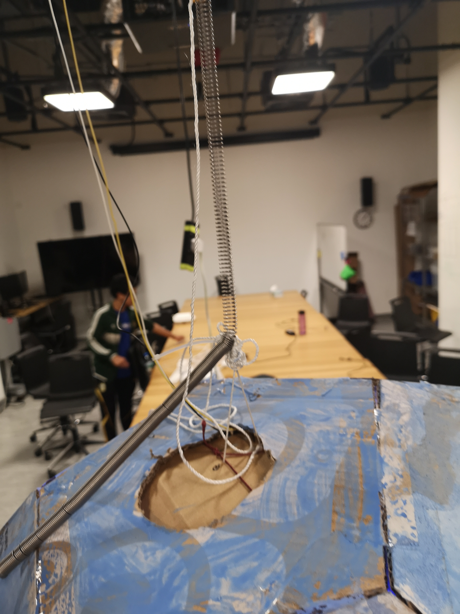

## For Thursday 24th:


#### Ahmed, Pangna, and Hatim's JellyBot

#### 09/10/2019 Update:

We are making a jellyfish Robot. The JellyBot is composed of 3 main parts:

  1. A traction system.

  2. The jellyfish body.

  3. The 4 tentacles of the jellyfish.


The features that we've already done:

  1. Built a body out of cardboard and painted it blue, with holes for the light, with tracing paper on top.

  2. Neopixels that shift between blue and purple inside the body.

  3. Built a support for the lifting mechanism.

  4. Built the basics for the legs and tested servos on them. 


The features that we want for sure to include in our JellyBot are (including partially completed ones), which will make our JellyBot "complete":

  1. All the parts are assembled together

  2. An autonomous lifting mechanism, with a spring between the mechanism and the body.

  3. Lights coming out of the body.

  4. Legs that move automatically, using randomness or noise.


Features that we might add depending on time and constraints:

  1. Wireless controls for the lift.

  2. Lights that react to a distance sensor.

  3. Legs that react to the distance sensor, maybe becoming wilder as people get closer.

  4. Springs between the body and the legs.
  
 #### 12/10/2019 Update:
 
 (Since I haven't posted any proper update, this is going to include everything I've done so far.)
 
 The first thing I did for this project was building the outer body for the Jellybot, which I wanted to be dome-like, but still made of cardboard for the sake of lightness and not to over-complicate it. I followed [this video](https://youtu.be/W-626HKjzQI) with slight modifications:
 
  1. I used smaller shapes (7 inch)
  
  2. I stopped adding pieces after I had made a half-sphere.
  
  3. I cut circular holes for light to come out of the jellyfish, and I glued tracing paper to filter it. I also cut a hole on top to carry the Jellybot up and down.
  
  4. I painted it with a light coat of blue.
  
  
  
  
  
  
  
  
  When I was done with this, I cut a long piece of cardboard to serve as the base of the body. On top of it, I built a sort of christmas tree shape with cardboard so that I could attach neopixels to it, this way, the light could be equally distributed amongst the holes of the Jellybot body. As for the neopixels themselves, I put a few pieces together and connected the power to 5V, ground to ground, and data in to pin 13, and I soldered it all together. Following [this tutorial](https://learn.adafruit.com/adafruit-neopixel-uberguide/basic-connections), I also added a 1000 µF capacitor to "prevent the initial onrush of current from damaging the pixels" between 5V and ground, and a 470 ohm resistor between data in and pin 13. 
  
  
  
  
  
  
  
  
  After this, I decided to add a distance sensor to the circuit, as to be able to change the colors coming out of the Jellybot depending on proximity, to simulate fear from predators. I attached the sensor's power to 5V, ground to ground, trigger to pin 9, and echo to pin 10, and soldered everything. I then put zip ties on the cables to have a bit less of a mess and give some relief to the connections. I also used velcro to attach the Arduino to the base as well as a power bank. I used [this tutorial](https://howtomechatronics.com/tutorials/arduino/ultrasonic-sensor-hc-sr04/) to figure out the sensor connections and code.
  
  
  
  
  
  
  
  
  
  
  
  
  
  
  As for the code, I started by modifying the strandtest example on the Arduino neopixels library to make the colors sweep from purple to blue. Then, I added code that takes data from the distance sensor to change the range of the colors; red to yellow if something is very close, green to blue in the middle, etc. The most difficult part of the code was making it so that the changes in color weren't too choppy/random since the sensor is extremely sensitive. I fixed this by calculating the average of the sensor values every few frames, and using a goTowards function so that the color ranges would change gradually rather than instantly.


``` 
float goTowards(float from, float to){
  if((from>to && from-lightStep<=to)||(from<to && from+lightStep>=to)||(from==to)){
    return to;
  }else if(from>to){
    return from-=lightStep;
  }else if(to>from){
    return from+=lightStep;  
  }
}
```


[My friend playing with the distance sensor](Video_20191012174602465_by_videoshow.mp4)


For now, I just blu-tack'd the sensor to the body of the Jellybot, as shown in the video, but I plan to eventually put it somewhere stationary so that the movement of the Jellybot doesn't interfere with it, and at chest level rather than leg level, which is easier to detect for the sensor.

 #### 24/10/2019 Update:
 
 Completing the Jellybot
 
 After Ahmed completed building the legs/tentacles, we attached it to the Jellybot body's sides, using rubber bands for the sake of wobbliness. Then, we attached the Arduino that controls the leg servos to the rest of the system. Some of the problems we encountered was too much string length, so we had to reduce the number of rubber bands, and we had to make the cables that go from the motors to the arduino longer since they ended up being too short. 
 
 
 
 
 
 Then, I added to my original code parts to make the it able to communicate distance data from my Arduino to Ahmed's and Pangna's. I took the code from [here](https://www.arduino.cc/en/Tutorial/MasterWriter?fbclid=IwAR1DgfeyhnNxPbi3eiOubrvFiZJVtF697opo13W2sDkcsFwpZzBRmvWT6fE). This way, the sensor can make the speed of the lifting mechanism faster, and the tentacles movement more erratic (the closer a body is to the sensor the faster the movement). Code for this can be found on Pangna and Ahmed's respective githubs. 
 
 For the Arduino cable connections, I used the examples on the same website. I connected analog input pin 4, pin 5, and ground of every Arduino together. What I later noticed is that this meant that the Arduino that controlled the neopixels (the master) wouldn't function properly unless every Arduino was turned on. While I passed the connections between the servos arduino and the neopixels arduino easily since they were on the same piece of cardboard, I had to pass the cables up to the lifting mechanism arduino through the hole on top of the Jellybot body. Finally I added some ziplocks for stress relief.
 
 
 
 
 
 Now we had to attach the Jellybot to the lifting mechanism, but first, we had to find somewhere to put the system that is high enough so that the Jellybot doesn't drag on the floor, and where there isn't a wall that blocks the Jellybot's movement. We settled on moving the two wooden benches in the IM lab so that they would face each other, and pass a metal bar through the holes at the top with the mechanism screwed to it. We also added an extra metal bar for extra stability and to prevent the motor piece from bending.
 
 
 
 
 
 
 
 
 After this, we attached the string to carry the Jellybot to the spring dangling from the mechanism, which we adjusted several times to have the best kind of movement and so that the Jellybot wasn't too low or too high. And we connected the master/slave cables through the hole on top of the body.
 
 
 
 
 
 While working on all this, the pieces of cardboard inside the body suddenly dissociated and threatened to destroy the entire system had we not caught it in time. I had thought that my build was robust enough, but I didn't account for the additional weight from the Arduino that controls the tentacles, the additional battery pack for it, and the movement up and down that would surely strain the whole thing. To fix this, I added more cardboard triangles, but I knew that this wouldn't be enough for the current system, so I drilled holes into the body and added 3 pieces of string that held the entire thing together. Aditionally, the pieces of string also attach the dome directly to the inner piece rather than just having it lay on top as it previously did. This also meant that it was not harder to look into the system and change cable connections etc, but by this time everything was working properly and for more than 30 seconds. 
 
 
 
 
 
  At some point in the process, we also glued velcro to the distance sensor and attached it to a chair at around chest level. I also made Ahmed redo the soldering on it since mine was pretty terrible.
  
  
  
  
  
  [A video of the Jellybot at work](https://drive.google.com/open?id=1KkYj-iAktZ0UBWY37PWaBK1H8wPveqPp)
