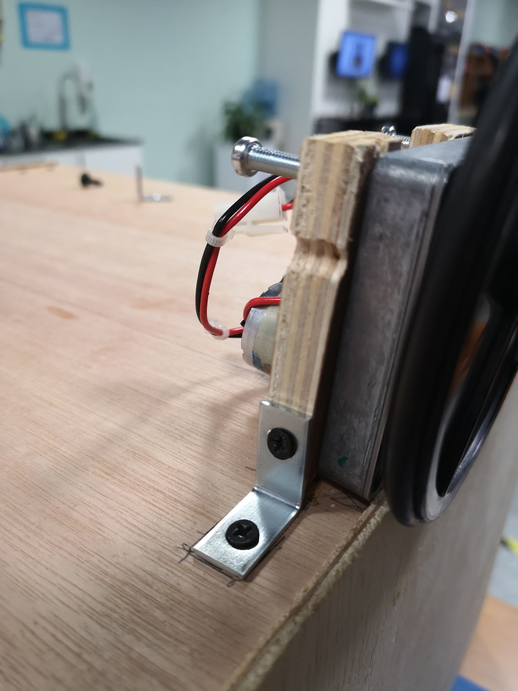

## Final Project Proposal

Idea 1: Orac\ebot

A robot that reads your future, inspired by fortuneteller machines. The robot would be constituted of a massive head that looks like an easter statue but with stereotypical female fortuneteller features, with 3 eyes. The head would be able to turn on a small base, which would be able to move around with a set of wheels. Features I would incorporate are LED strips behind the eyes that change colors, and Servo motors that move the eyelids up and down every now and then. I would also put a speaker inside of the robot so that the oracle would be able to speak. Finally, I would have a hole in the body for a coin to be dropped and "activate" it (get your fortune told). 

In its idle state, the robot would make small movements around and blink from time to time, except for its third eye which would remain closed. It would also say some pre-recorded voicelines pre-processed to sound robotic, kind of like (https://youtu.be/8tg5f09itnI)[GLaDOS's voice in Portal]. It would say stuff like "Downloading future..." "When all living beings die I will remain" "Have you opened your third eye yet?". 

If we go the small shorts route like Ahmed(?) suggested, my oracle could walk on stage first and give a quick introduction to the performances and walk off. For the actual performance, I would imagine that either a performer or an audience member would walk to the robot and put a coin inside to hear the fortune. Then, lights would start flashing back and forth in different colors behind the oracle's eyes, and its third eye would open. The robot would read the person's fortune. Examples of possible lines are: "Your favorite color is #4287f5" (during which her eyes would shine in that color), "You will have 679921863 children", "You are a comprehensive puzzling abiding whispering ambiguous person". The specific values like the number of children and adjectives would be randomly generated. It would conclude the fortune with something like "You are a being of flesh and soon you will die. I will remain". The lines could be either pre-recorded or enacted by an actor with a mic in the back, and being processed to sound robotic. While the robot is talking, it would also be moving around the person it's reading the fortune of and looking at them. Ideally this would happen automatically, but I figure that this would be too hard since the person might move around, so bluetooth controls would probably make more sense.

I really wanted to incorporate spider legs in my project but I figured that it would be too difficult, so I figured that it would still be aesthetically nice to have spider legs that dangle from the base while the wheels actually move it.  

## Technical Needs:

Voice:
- Mic
- Wireless speaker
- (My) computer

Movement:
- 2 drive wheels
- 2 wheel motors
- 2 caster wheels
- Battery pack
- Bluefruit

Rotation (of the body on the base):
- 2 drive wheels
- 2 wheel motors
- 2 caster wheels
- Battery pack

Eyes:
- Neopixels (150+)
- 3 servos (for the eyelids)
- Powerbank
- Batteries for the servos

## Update 15/11/2019:

I emailed Jon to help me with building my robot for Sunday, so I made sketches of all the parts I need to make:

The essential parts I need to make are:

- A circular or cubic base for the wheels to be attached, and with a fake coin slot hole.

- A thin circular piece to rotate on top of the base. I might just use Angelina's old base for this.

- Rods to attach on the circular piece to support the face.

- A face piece with plywood to wrap around the rods. Needs to have holes for 3 eyes and for mouth.

Less essential:

- A nose.

- A hair/hat piece.

In the meantime, I worked on making a Max patch that makes a robot voice. What it basically does it modulate the pitch of the input randomly every second.

## Update 18/11/2019

I went to the wood shop and built the base for the OracleBot, with the help of Michael and Jon.

The base has two 50cm wide square base and a height of 30cm, with all sides but one covered with plywood and with wood blocks supporting the construction. There is also a hole in the front panel for coin insertion, and a hole in the base to have cables pass through.

Next, I had to fix the motor wheels to the base, which proved trickier than I thought it would. I mistakenly used the wrong kind of bolts to screw on the wheel motors, and the pieces of wood I used to connect them to the base split in the middle because they were too thin. The structure was also generally unstable, and I had to redo it.

The second time over, after Michael gave me his advice, I used the special bolts for the motors, and connected the metal brackets to the motors directly. Then, I cut up a piece of wood to connect it to a caster wheel. But after screwing the whole thing together, I realized that I had cut the wood too tall and the structure was really unstable, so I cut up the wood shorter and changed the wheels to a triangular shape with only 3 wheels. 

Finally, I soldered the cables coming out of the wheel motors to longer cables so that connecting them to the Arduino would be easier, and I passed them inside of the box.

