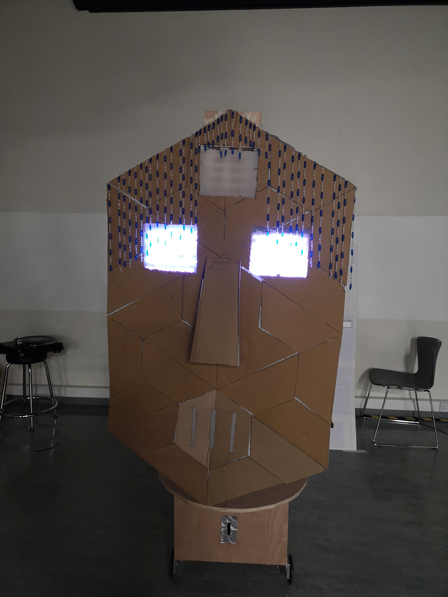
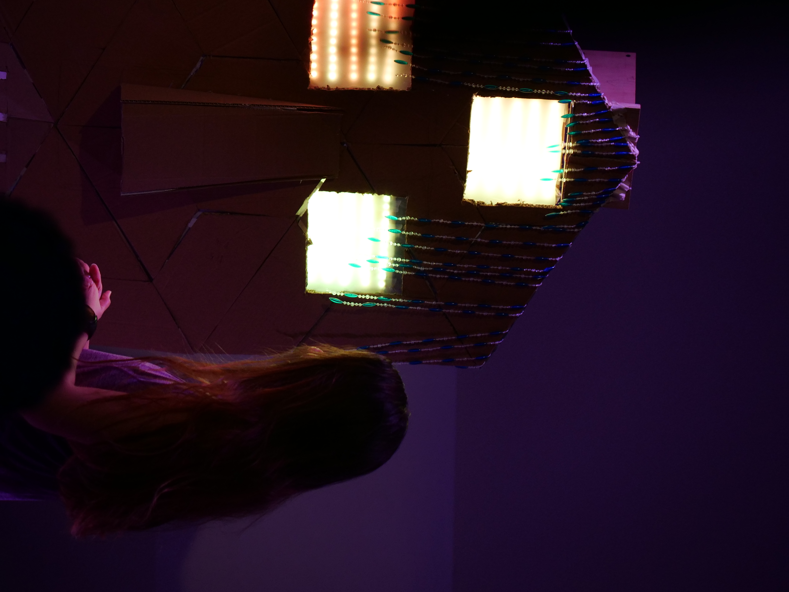
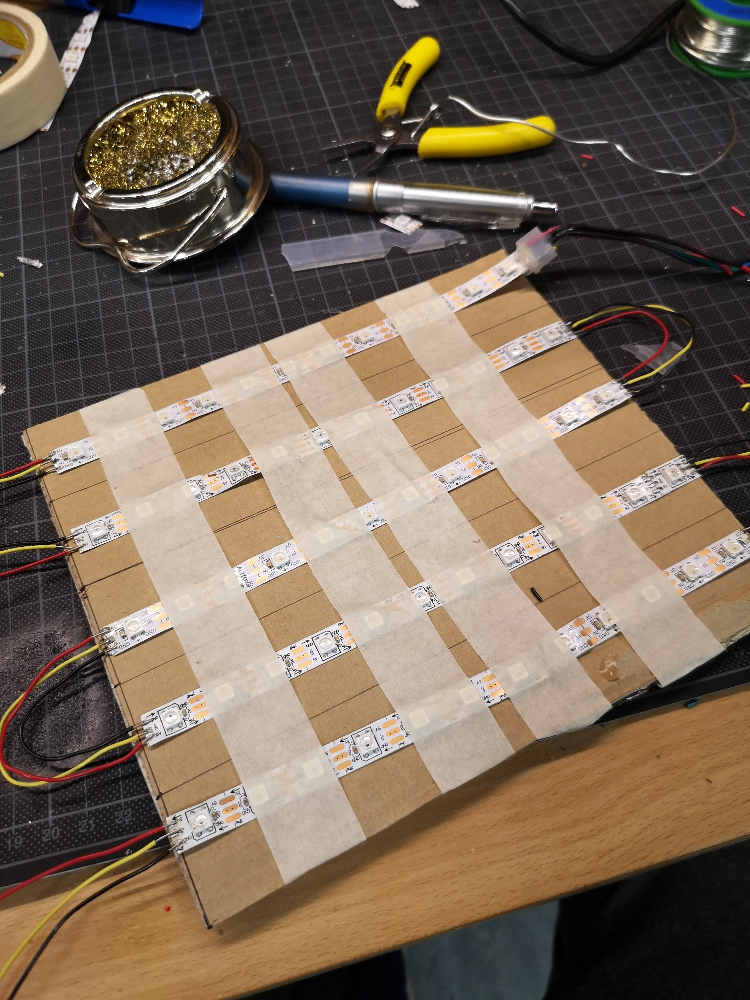
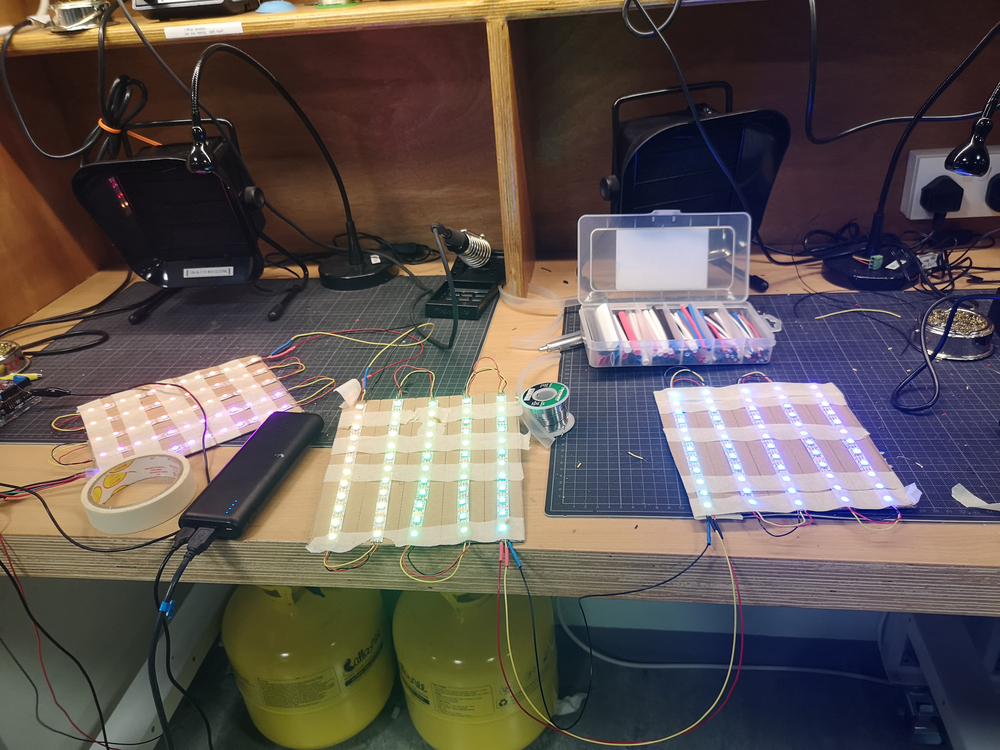
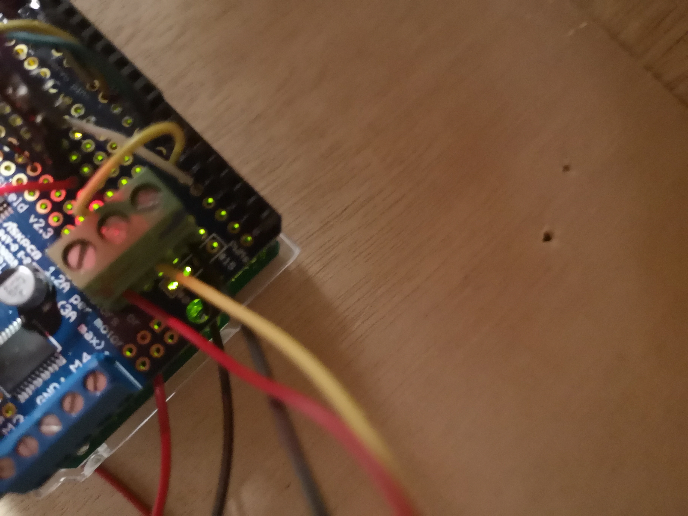
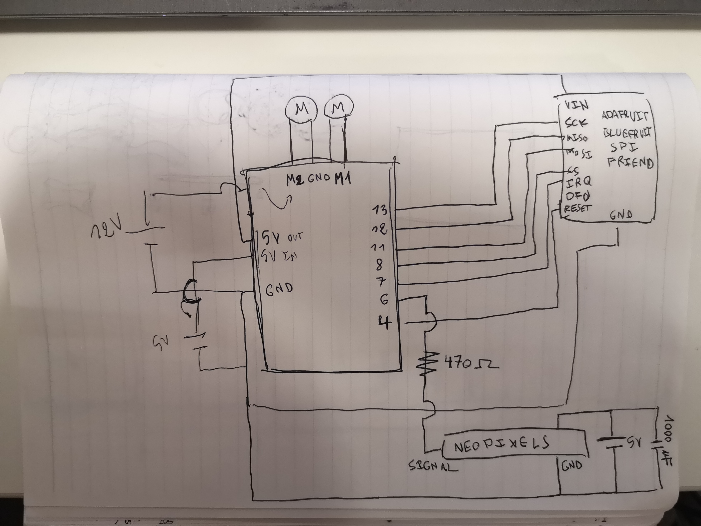
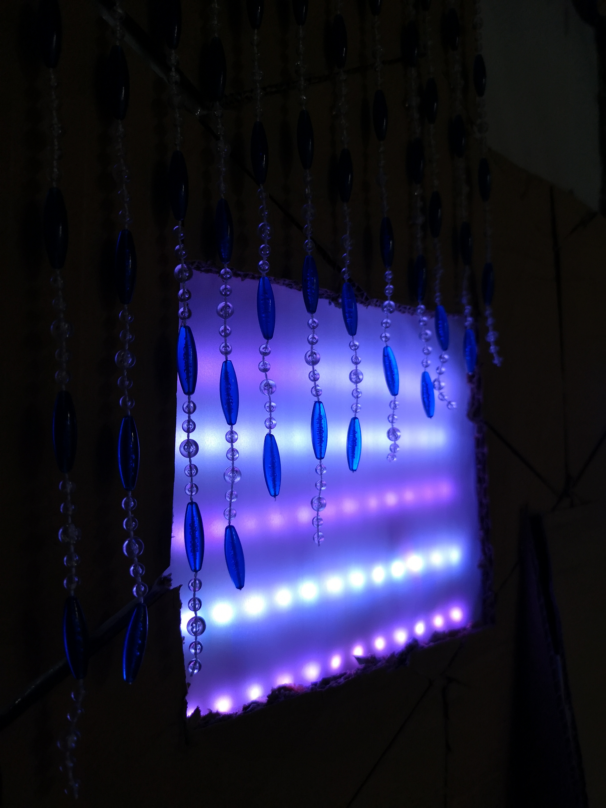

## Overall Project

[The performance](https://drive.google.com/file/d/1B5znKoT-wUyXKrR-d7GGR4OiUYsLh9e6/view?usp=sharing), starts around minute 35 and ends around minute 40.

[The script](https://docs.google.com/document/d/1VrFPgFH1HZpqHsa-KNYwGzadWDxJY4tz6Mw3i6N2MJ8/edit?usp=sharing)

My project is the oracleBot, an almost 2-meter long actor robot built of wood and cardboard that moves around on two wheels and has three eyes that blink and change colors. The oracleBot is controlled by a bluetooth app on my phone. The robot also "speaks" somebody's fortune after they put a coin inside by putting a speaker behind her face connected to a pc with a Max robot voice patch, a mic, and a performer.  

The important parts I used are:

- Neopixels
- 2 DC motors
- An Arduino Uno
- An Adafruit Motorshield
- A 5V power bank
- A 12V lithium battery
- A bluetooth speaker
- A Shure 58 mic
- An M-Track interface

- Wood
- Cardboard
- A beads curtain
- An empty coke can

The main problems I encountered are:

- How to build a robot this massive and making sure it doesn't fall apart
- Balancing the robot correctly
- How to simulate blinking without servos
- Motors not going at the same speed and skewing the direction
- Recalling the color of every LED after turning them off during blinking animation
- Making the sound coming out robotic yet understandable

This is all discussed further in the progress updates below.

## Final Project Proposal

Idea 1: Orac\ebot

A robot that reads your future, inspired by fortuneteller machines. The robot would be constituted of a massive head that looks like an easter statue but with stereotypical female fortuneteller features, with 3 eyes. The head would be able to turn on a small base, which would be able to move around with a set of wheels. Features I would incorporate are LED strips behind the eyes that change colors, and Servo motors that move the eyelids up and down every now and then. I would also put a speaker inside of the robot so that the oracle would be able to speak. Finally, I would have a hole in the body for a coin to be dropped and "activate" it (get your fortune told). 

In its idle state, the robot would make small movements around and blink from time to time, except for its third eye which would remain closed. It would also say some pre-recorded voicelines pre-processed to sound robotic, kind of like (https://youtu.be/8tg5f09itnI)[GLaDOS's voice in Portal]. It would say stuff like "Downloading future..." "When all living beings die I will remain" "Have you opened your third eye yet?". 

If we go the small shorts route like Ahmed(?) suggested, my oracle could walk on stage first and give a quick introduction to the performances and walk off. For the actual performance, I would imagine that either a performer or an audience member would walk to the robot and put a coin inside to hear the fortune. Then, lights would start flashing back and forth in different colors behind the oracle's eyes, and its third eye would open. The robot would read the person's fortune. Examples of possible lines are: "Your favorite color is #4287f5" (during which her eyes would shine in that color), "You will have 679921863 children", "You are a comprehensive puzzling abiding whispering ambiguous person". The specific values like the number of children and adjectives would be randomly generated. It would conclude the fortune with something like "You are a being of flesh and soon you will die. I will remain". The lines could be either pre-recorded or enacted by an actor with a mic in the back, and being processed to sound robotic. While the robot is talking, it would also be moving around the person it's reading the fortune of and looking at them. Ideally this would happen automatically, but I figure that this would be too hard since the person might move around, so bluetooth controls would probably make more sense.

I really wanted to incorporate spider legs in my project but I figured that it would be too difficult, so I figured that it would still be aesthetically nice to have spider legs that dangle from the base while the wheels actually move it.  

## Technical Needs:

Voice:
- Mic
- Wireless speaker
- (My) computer

Movement:
- 2 drive wheels
- 2 wheel motors
- 2 caster wheels
- Battery pack
- Bluefruit

Rotation (of the body on the base):
- 2 drive wheels
- 2 wheel motors
- 2 caster wheels
- Battery pack

Eyes:
- Neopixels (150+)
- 3 servos (for the eyelids)
- Powerbank
- Batteries for the servos

## Update 15/11/2019:

I emailed Jon to help me with building my robot for Sunday, so I made sketches of all the parts I need to make:

The essential parts I need to make are:

- A circular or cubic base for the wheels to be attached, and with a fake coin slot hole.

- A thin circular piece to rotate on top of the base. I might just use Angelina's old base for this.

- Rods to attach on the circular piece to support the face.

- A face piece with plywood to wrap around the rods. Needs to have holes for 3 eyes and for mouth.

Less essential:

- A nose.

- A hair/hat piece.

In the meantime, I worked on making a Max patch that makes a robot voice. What it basically does it modulate the pitch of the input randomly every second.

## Update 18/11/2019

I went to the wood shop and built the base for the OracleBot, with the help of Michael and Jon.

The base has two 50cm wide square base and a height of 30cm, with all sides but one covered with plywood and with wood blocks supporting the construction. There is also a hole in the front panel for coin insertion, and a hole in the base to have cables pass through.

Next, I had to fix the motor wheels to the base, which proved trickier than I thought it would. I mistakenly used the wrong kind of bolts to screw on the wheel motors, and the pieces of wood I used to connect them to the base split in the middle because they were too thin. The structure was also generally unstable, and I had to redo it.

The second time over, after Michael gave me his advice, I used the special bolts for the motors, and connected the metal brackets to the motors directly. Then, I cut up a piece of wood to connect it to a caster wheel. But after screwing the whole thing together, I realized that I had cut the wood too tall and the structure was really unstable, so I cut up the wood shorter and changed the wheels to a triangular shape with only 3 wheels. 

I also soldered the cables coming out of the wheel motors to longer cables so that connecting them to the Arduino would be easier, and I passed them inside of the box.

Finally, I tested my 2 dc motors and 2 servos and they all seem to work fine. I still need 1 more servo though.

## Update 21/11/2019

On class last tuesday, I went to the scene shop to build my robot's face, which was supposed to be in plywood and have a half-circle bend, but after listening to Jon's advice, I decided against it. According to him, the structure for the plywood would be too complicated and time-consuming, and I figured that any other kind of wood would be too heavy for the wheels anyway. I scrapped my plan and decided to make the face out of cardboard. I still needed to build a base and a support rod for it though. The circular base is about 70 cm in diameter and the rod is 160 cm tall. I then screwed them on top of my box. I also drilled in holes to be able to pass wires and plastic cable ties. 

The next thing I did was solder the Bluefruit on my motor shield, for which I just followed the tutorial (and schematic) provided by Michael. This took an abnormally long time because I am bad at soldering. I do not look forward to soldering the neopixels for the eyes.

I still needed to build 80% of my robot, so I had to get started on my face. After scrapping the original concept I didn't really know what to do since I couldn't find a piece of cardboard that's big enough for the whole face. I was thinking of copying the banana beel structure Praggya used for her robot, but it didn't really fit the image of the oracleBot that I had in mind. So I took a walk outside and had an epiphany

I looked at the ground outside and saw that parts of the tiles kind of looked like angry eyes and a long nose, and I also saw that the angles the pieces made kind of fit what I wanted my face to look like, so I decided to copy it.

(I'm not done with the face yet)

## Update 26/11/2019

I finished making the face out of cardboard pieces, and I cut holes for the eyes and the mouth. I didn't take a good picture of it thought so I'll post one later.

Hooking the face up to the body was tricky, so I asked Michael for help. After getting his advice, I decided to hot glue a bunch of cardboard rods to the central support rod and then glue them to the face, with a lot of triangles. I also added pieces of string last minute. I don't really know right now if it'll hold and I'll need to strengthen it, but I guess I'll know if it all falls down by tomorrow morning.

After this, I got a battery for my wheel motors, soldered it to my system and velcro'd it to the base, along with the arduino and the powerbank. 

Finally, I followed Michael's tutorial on using the blueFruit and I modified the code in the motorShield example given to make the robot turn in different directions. I recorded the robot moving [here](https://drive.google.com/open?id=1RndNPafpCbciJq6_Pg6yhAGKAsayjquQ). 

In the future, I'd like to add an option for the robot to turn while moving forward if I were to press two directions at the same time (left and forward for example). I think that I have the essentials now, but here's the features I still would like to add:

- Neopixel eyes that change colors
- Eyelids that blink using servos
- Making the robot pretty (adding more cardboard pieces in the back for more 3 dimensionality, painting it, adding some sort of a headpiece)

## Update 28/11/2019

Yesterday night, I borrowed a bluetooth speaker from the IM lab and a mic and cables from the equipment center to see how to talking part would work. I had to adjust the gate on my Max patch since there was some feedback between the mic and the speaker even when they were far from each other, but it worked well enough. A problem was that what the voice was actually saying wasn't really clear, so I might modify the patch to mix the normal voice and the processed voice together so that you could still understand it. [Here's a video of sound coming out of the robot.](https://drive.google.com/file/d/1SWn7Q2SJ-PX6ub1K_yO9yq7nzKerfcfE/view?usp=sharing)

Then I started working on the neopixels. Soldering them was a really painful process because the copper part on the LEDs kept breaking off if I moved it around too much, and the solid wires that I used weren't flexible enough. I figured that they would be less messy to work with than stranded wire, but they ended up giving me a lot of trouble and for about 4 hours I was stuck in a cycle of testing the lights, realizing current didn't reach one of them, trying to fix it, accidentally breaking the connections for another one, and replacing it with new pieces. The LEDs I took from the drawer were also not very reliable. [This video](https://youtu.be/QYa7MfUcUzc) helped a lot though.

Initially I had planned to cover the eyes with neopixels, but I realized that this would take too many of them (about 648 of them) and it would just take too long to solder, so I decided instead to have 5 rows of 12 for each eye. I've made two so far, and I've got the third one left to do, as well as coding their behavior and securing the system on my robot and to the arduino. During my process, I realized that the servos for the eyelids would be too tricky to handle, so I might just simulate them with neopixels going on and off, but I'm afraid now that my robot might have too little practical functionality.

[A video of an eye at work with an example code](https://drive.google.com/file/d/1SG9R_COR0_Pv1I3b4KNo0FGJnOfU8f97/view?usp=sharing)

## Update 2/12/2019

I finished soldering the neopixels together and I taped them to pieces of cardboard. I also added more cardboard on the sides to glue the pieces of wire that stick out on. I also modified the cardboard pieces I'd put behind my robot's eyesockets so that they'd fit the pieces I had now, then I put them up. Then, I soldered a 3-pin screw terminal to my Arduino connected to the powerbank cable and to the 6 pin so that I could easily connect and disconnecting the neopixels to the rest of my system.

After I put everything together, I tested the code to see if everything works fine, but the neopixels seemed to get some sort of interference that didn't let it run smoothly. I realized afterwards that this was because I forgot to connect the ground of the neopixels to the ground of the Arduino, which I've now rectified.

I then added the possibility to move diagonally to my code, which can happen if I press both forward and right/left. I did this by making both of the wheels go forward but with one slower than the other. I noticed then that the robot moved slightly to the right even when going forward, so I should look for a fix for this. I'll charge my motor battery tonight since I haven't gotten to do that yet and see if it helps. 

Then, I started working on the code for the neopixels. The first thing I did was mapping the position of each individual LED to an array so that they would be easier to track (so the top left one of the first eye would be the first one in the array). This was when I started encountering this problem where using an array that was too big (more than 150 integers) would just stop my program from working, which still puzzles me, so I had to find a way to work around it since I have 180 LEDs. 

Second thing I worked on was the blinking of the eyes. This in itself wasn't hard to do, but keeping track of the colors of each LED so that I would restore it at the end of the blinking was easier said than done, and the array size problem made it harder. In the end, I made a system that changed the colors from the based on one initial hue of the leftmost LED that changed over time so that I could just recalculate it when when reeastablishing the colors instead of needing to keep track of each neopixel.

Finally, I made the 3 button on my phone app open and close the 3rd eye.

[blink](https://drive.google.com/open?id=1U2vyyUvFzmR9d2iBpMv5ae-omlJ5iC3U)

[third eye](https://drive.google.com/open?id=1TYcXNYht1bIaIbmNXJHzCiDYe3W7EQ9U)

## (Final) Update 15/12/2019

In addition to what the eyes could already do, I made the button 2 on my bluefruit change the eyes to one single random color, which is used at the part where the robot goes "your favorite color is...". The button 1 changes every neopixel to a random color, which is used to show the robot loading information, calculating, or having an error. The button 3 still opens and closes the third eye. The button 4 makes the eyes go brighter and with more saturation, which I use to introduce some variety while the robot is speaking. 

I also fixed the robot walking in a skewed direction when going forward after testing the motors and adjusting the speed, and I made it possible to move diagonally backwards. 

After this, my robot was functionally done, so I worked a bit on the way it looked. I first tried a straw wig from the prop shop but it didn't really look right, so I went out to a gift collection shop in the city and bought a beads curtain, which I cut up and glued to the top of my robot's head. I also cut up a cardboard nose and glued it to the face, and I cut up aluminum foil to put around the coin slot. I velcro'd an empty coke can inside of the box right below the coin slot so that putting a coin would make a metallic noise.

As for the performance, I wrote a script which can be found [here](https://docs.google.com/document/d/1mc8oK99ZcNWVnOjzFkwujoQcov5DJmHwMEPRP56nHxc/edit?usp=sharing), and a shorter version with more stage directions [here](https://docs.google.com/document/d/1VrFPgFH1HZpqHsa-KNYwGzadWDxJY4tz6Mw3i6N2MJ8/edit?usp=sharing). In the script, I called the performer who would get their future written Alice based on Gabi's Alice in Wonderland idea. I then practice the script a few times with Gabi as the voice of the robot and Carlos Paez as Alice using the following audio equipment:
- A bluetooth speaker borrowed from the IM lab
- A Shure 58 mic from the music equipment center
- A M-Track interface to connect the mic to my pc
- A usb cable
- An XLR cable
The rehearsals with Carlos went fine, but we eventually realized that it would be a more fun performance if the person didn't know what they were getting into, so we decided at the end to just pick someone from the audience for the Alice role and allow Gabi to improvise a little bit. I would also look for the person's information (full name, birthday, astrological sign) on facebook to freak them out.

[The performance is here, starting around minute 35 and ending at minute 40.](https://drive.google.com/file/d/1B5znKoT-wUyXKrR-d7GGR4OiUYsLh9e6/view?usp=sharing)

Overall, the funcionality of the robot and the performance went well, but it was unfortunate that the sound system didn't really work as intended. While there was nothing wrong with my Max patch (I think), it always takes a long time to set it up and adjust all the levels accordingly, time that I didn't have inbetween performances. I also didn't want to test the voice in front of everyone so that there would still be an element of surprise at the beginning. Gabi still spoke loudly enough so that most people could understand her, so it wasn't that big of a deal. 

